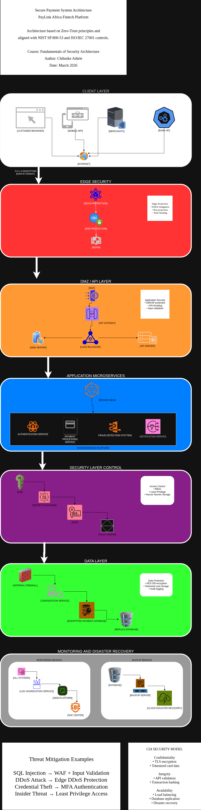

# 🔐 PayLink Africa – Secure Payment System Architecture

This project presents a **secure system architecture design** for a fintech platform, PayLink Africa, which supports digital wallets, online payments, and API integrations with financial institutions.

It demonstrates practical application of core cybersecurity principles including:
- Defense in Depth
- CIA Triad (Confidentiality, Integrity, Availability)
- Least Privilege Access Control
- Risk Mitigation Strategies

---

## 🏗️ Architecture Overview

The system is designed using a **layered security architecture**:

- **Client Layer** (Users, Mobile, Web)
- **Edge Security Layer** (DDoS Protection, Firewall, WAF)
- **DMZ/API Layer** (API Gateway, Reverse Proxy)
- **Application Layer** (Microservices Architecture)
- **Security Control Layer** (IAM, KMS, Secrets Manager)
- **Data Layer** (Encrypted Databases, Tokenization)
- **Monitoring & DR Layer** (SIEM, Logging, Backup Systems)

---

## 🔐 Security Features

### Confidentiality
- TLS 1.3 encryption for data in transit
- AES-256 encryption for data at rest
- Tokenization of sensitive card data
- Strong Identity & Access Management (IAM)

### Integrity
- Web Application Firewall (WAF) for input filtering
- API Gateway validation and rate limiting
- Transaction validation in microservices
- Audit logging for tamper detection

### Availability
- Load balancing for traffic distribution
- Database replication and failover
- Cloud-based disaster recovery backups

---

## 🛡️ Defense in Depth

Multiple layers of security controls are implemented:
- Perimeter security (Firewall, DDoS protection)
- Application security (WAF, API Gateway)
- Internal service security (Service mesh)
- Data protection (Encryption, tokenization)

---

## ⚠️ Threats & Mitigation

| Threat | Mitigation |
|------|-----------|
| SQL Injection | WAF + Input validation |
| DDoS Attacks | Edge protection systems |
| Credential Theft | Multi-Factor Authentication (MFA) |
| Insider Threats | Least privilege + audit logging |

---

## 📚 Frameworks & Standards

This design is influenced by:

- NIST SP 800-53
- ISO/IEC 27001
- OWASP Top 10

---

## 📄 Documentation

Full report available here:  
👉 [Download PDF](SECURE-PAYMENT-SYSTEM-ARCHITECTURE-by-ADIELE.pdf)

---

## 👨‍💻 Author

**Chibuike Adiele**  
Cybersecurity Enthusiast  

---

## 💡 Key Takeaway

This project demonstrates how secure architecture principles can be applied in real-world fintech systems to balance **security, scalability, and performance**.
