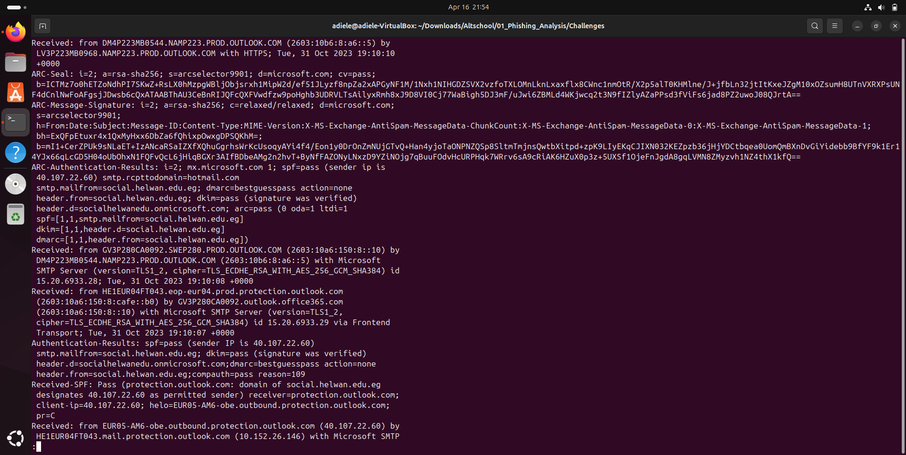
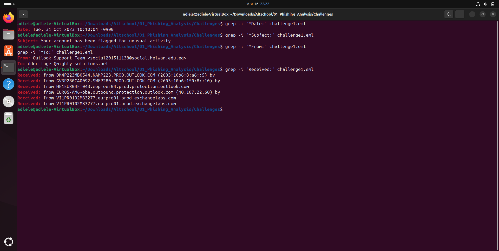
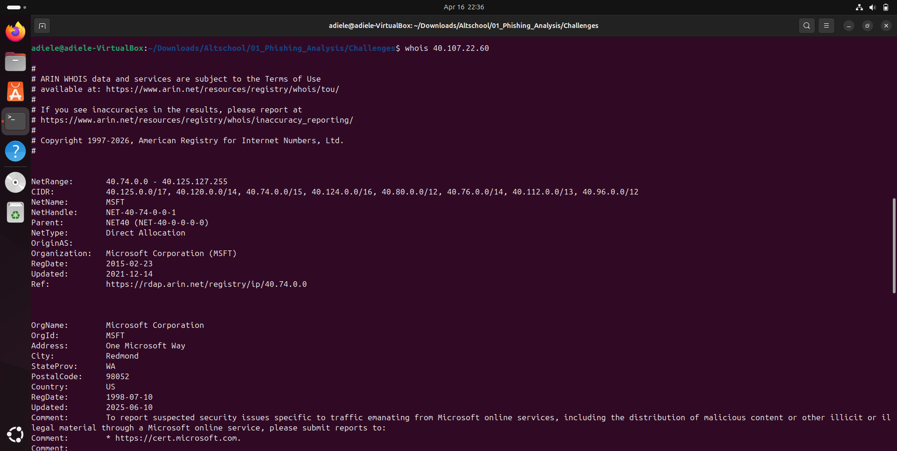
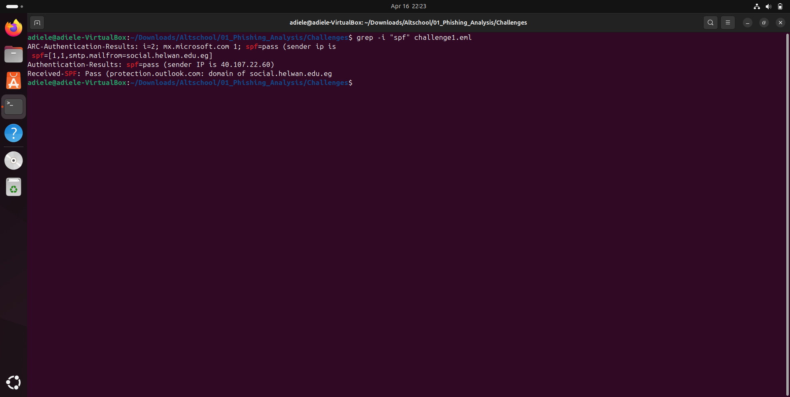
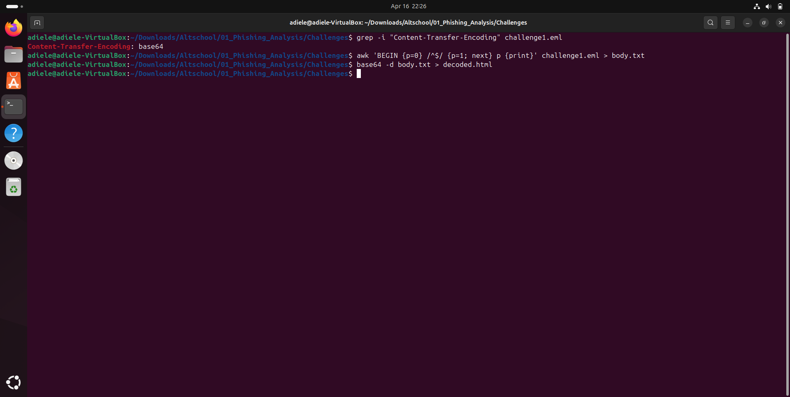

# 🛡️ Phishing Email Analysis (SOC Simulation)

## 📌 Overview
A suspicious email was reported by a user claiming their account access had been disabled. However, the user still retained access, raising suspicion of a phishing attempt.

This project documents a full SOC-style investigation of the email using header analysis, decoding techniques, and threat intelligence.

---

## 🎯 Objectives
- Determine if the email is malicious
- Identify attacker infrastructure
- Extract and analyze embedded URLs
- Validate threats using threat intelligence

---

## 🧪 Environment
- Ubuntu VM (VirtualBox)
- Tools Used:
  - Linux CLI (grep, awk, base64)
  - nslookup, whois, dig
  - VirusTotal

---

## 📥 Step 1: Initial Email Inspection



The email was analyzed in raw `.eml` format to avoid accidental execution of malicious content.

---

## 📧 Step 2: Header Analysis



### Key Findings:
- **Subject:** *(replace with your answer)*
- **Recipient:** *(replace with your answer)*
- **Sender (Display Name):** *(replace)*
- **Actual Sender Email:** *(replace)*

⚠️ Observation:
The sender's display name impersonates a trusted entity while the actual email domain differs — a common phishing technique.

---

## 🌐 Step 3: Sender Infrastructure Analysis



- **Sender IP:** *(replace)*
- **Resolved Hostname:** *(replace)*
- **Organization:** *(replace)*

⚠️ Observation:
The email originated from infrastructure not associated with the claimed sender.

---

## 🛡️ Step 4: Authentication Check



- **SPF Result:** *(replace)*

⚠️ Observation:
SPF failure indicates the sender is not authorized to send emails on behalf of the domain.

---

## 🔐 Step 5: Email Body Encoding Analysis



The email used base64 encoding, requiring decoding to reveal its contents.

```bash
awk 'BEGIN {p=0} /^$/ {p=1; next} p {print}' challenge1.eml > body.txt
base64 -d body.txt > decoded.html

⚠️ Observation:
Encoding is often used to evade detection by email security filters.

## 🔗 Step 6: URL Extraction

Extracted URLs:
https://raw.githubusercontent.com/MalwareCube/SOC101/main/assets/01_Phishing_Analysis/microsoft.jpg
https://0.232.205.92.host.secureserver.net/lclbluewin08812/
🚨 Malicious URL (Defanged)
hxxps[://]0[.]232[.]205[.]92[.]host[.]secureserver[.]net/lclbluewin08812/

⚠️ Observation:
The attacker used a trusted hosting provider combined with an IP-based subdomain to disguise the malicious link.

🦠 Step 7: Threat Intelligence Validation

Fortinet Verdict: Phishing

🚨 Indicators of Compromise (IOCs)
hxxps[://]0[.]232[.]205[.]92[.]host[.]secureserver[.]net/lclbluewin08812/
Suspicious sender domain
Encoded email body

🧠 Final Analysis

This email exhibits multiple characteristics of a phishing attack, including spoofed sender identity, failed authentication checks, and a malicious URL designed to harvest user credentials.

✅ Verdict

Phishing Email — Not Genuine

🛡️ Recommendations
Block sender IP and domain
Blacklist malicious URL
Enforce SPF, DKIM, and DMARC policies
Conduct user awareness training

📚 Skills Demonstrated
Email Header Analysis
Threat Intelligence Analysis
Linux Command Line for Security
Phishing Detection Techniques
SOC Investigation Workflow
