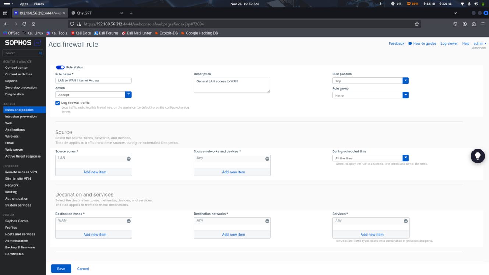

# Sophos Firewall — Network Perimeter Security

---

## Objective
Deploy and configure a Sophos Firewall to enforce network segmentation,
control inbound and outbound traffic, and detect malicious activity
within a simulated enterprise network.

---

## Lab Environment

- Firewall: Sophos XG Firewall  
- Internal Network: LAN  
- External Network: WAN  
- Monitoring: Sophos Firewall Logs & IPS  

---

## Network Architecture
The firewall was positioned between the internal network and the
internet, acting as the primary security gateway. Network zones were
used to separate trusted and untrusted traffic.

This design ensures:
- External traffic is inspected before reaching internal systems  
- Internal systems cannot freely communicate with the internet  
- Security policies can be enforced at the perimeter  

---

## Firewall Status

The dashboard confirms:
- Firewall is active  
- Interfaces are up  
- Security services (IPS, Application Control) are enabled  

---

## Network Zones

Zones were configured to separate:
- LAN (trusted)
- WAN (untrusted)

This prevents direct trust between internal and external networks.

---

## Firewall Rules

Traffic rules were created to:
- Allow required outbound web traffic  
- Block unauthorized inbound connections  
- Restrict access to sensitive services  

Each rule follows **least privilege** — only required services are allowed.

---

## Traffic Monitoring

Firewall logs show blocked connection attempts, proving that the policy
is actively preventing unauthorized access.

---

## Intrusion Prevention & Threat Detection

The Sophos IPS engine detected and blocked suspicious traffic, stopping
potential exploitation before it could reach internal systems.

---

## Security Value

This firewall provides:
- Network perimeter defense  
- Attack surface reduction  
- Threat detection and prevention  
- Visibility into network activity  

This is a core defensive control in enterprise environments.

---

## SOC Relevance

From a SOC perspective, this firewall enables:
- Monitoring of malicious traffic  
- Alerting on intrusion attempts  
- Investigation using firewall logs  

This makes it a critical data source for incident detection and response.
