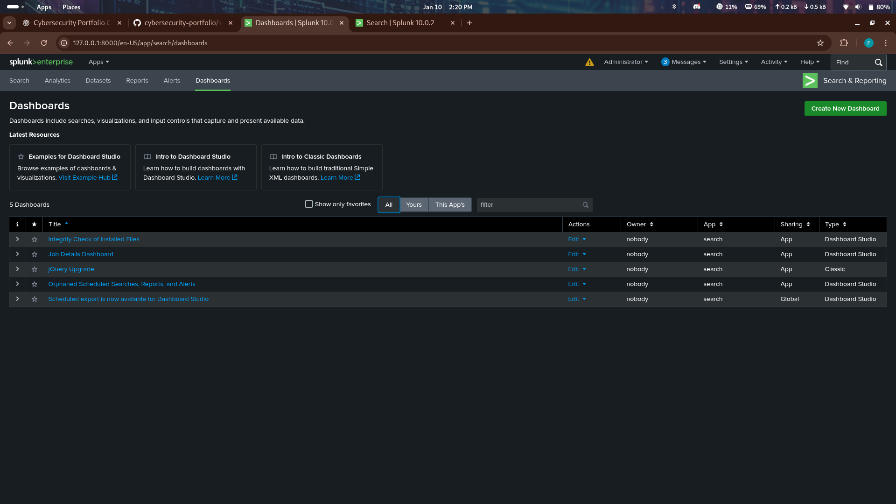
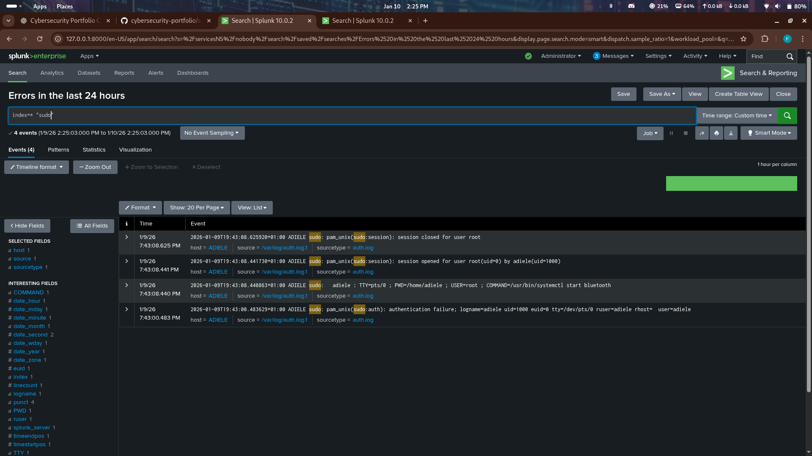
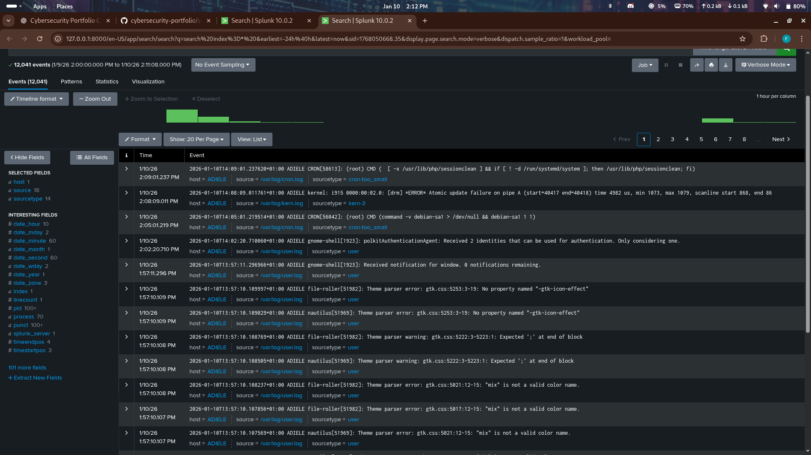

# Splunk SIEM — Log Analysis & Threat Investigation

---

## Objective
Deploy Splunk as a Security Information and Event Management (SIEM)
platform to collect, analyze, and investigate security events across
network and endpoint systems.

---

## Lab Environment

- SIEM: Splunk Enterprise  
- Log Sources:
  - Windows Event Logs  
  - Linux Syslogs  
  - Firewall Logs  
- Analysis Tools:
  - Splunk Search Processing Language (SPL)

---

## Log Ingestion

Multiple log sources were configured to forward events into Splunk,
providing centralized visibility across the environment.

This enables:
- Threat correlation  
- Timeline reconstruction  
- Security alerting  

---

## Security Monitoring Dashboard

Dashboards were used to visualize:
- Failed logins  
- High-risk IP addresses  
- Suspicious activity  

---

## Attack Detection

Splunk SPL queries were created to detect:

- Brute-force login attempts  
- Excessive authentication failures  
- Suspicious IP activity  

Example detection logic:

index=security sourcetype=windows EventCode=4625
| stats count by src_ip
| where count > 10

This identifies IP addresses attempting repeated login failures.

---

## Incident Investigation

Using Splunk search, analysts were able to:
- Track attacker IPs  
- View timelines  
- Correlate multiple log sources  

---

## Threat Confirmation

The detected activity was confirmed by:
- Windows event logs  
- Firewall logs  
- Authentication failures  

This cross-log validation reduces false positives.

---

## SOC Value

This Splunk deployment provides:
- Centralized visibility  
- Threat detection  
- Incident investigation  
- Audit and compliance reporting  

This is how modern SOC teams identify and investigate security incidents.
